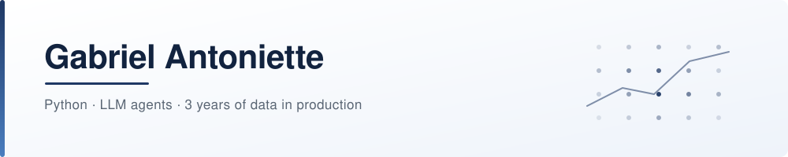

<p align="center">
  <picture>
    <source media="(prefers-color-scheme: dark)" srcset="assets/banner-dark.svg">
    <source media="(prefers-color-scheme: light)" srcset="assets/banner-light.svg">
    
  </picture>
</p>

<p align="center">
  
</p>

<p align="center">
  <a href="https://www.linkedin.com/in/gabriel-antoniette/">
    
  </a>
  <a href="mailto:gabrantoniette@gmail.com">
    
  </a>
  
  
</p>

---

### About

Short version: I spent three years making sure data was right before anyone made a decision with it. Now I'm doing the same thing one layer up, for models.

My current job is called Data Quality Analyst. What I actually do is find where a model gets things wrong: which field it misreads, which entities it misclassifies, how much of that would reach production if nobody checked. Around 20,000 transaction batches a week. Nobody calls it evaluation on the org chart, but that's what it is.

I don't have professional experience as an AI engineer yet, and I'd rather say that out loud than dress it up. What I do have is three years of production data work, plus the systems I'm building on my own time to close the gap: LLM pipelines, multi-agent orchestration, and the boring infrastructure that makes them survive contact with reality.

Everything I build ends up here, working, with the decisions written down.

```python
from dataclasses import dataclass


@dataclass(frozen=True)
class Gabriel:
    now: str = "Data Quality Analyst, model evaluation in practice"
    heading: str = "AI Engineering"
    stack: tuple[str, ...] = ("Python", "FastAPI", "PostgreSQL", "Docker", "LLM agents")
    background: tuple[str, ...] = ("3 years of data in production", "ETL", "BI")
    education: str = "B.Sc. Data Science, FIAP"
    languages: tuple[str, ...] = ("Portuguese (native)", "English")

    def currently_building(self) -> str:
        return "multi-agent systems in Python, and the tests that keep them honest"

    def open_to(self) -> list[str]:
        return ["AI engineering roles", "technical conversations", "code review"]
```

---

### Stack

**AI and Python**

<p>
  
  
  
  
  
</p>

**Backend and data**

<p>
  
  
  
  
  
</p>

**Infrastructure**

<p>
  
  
  
</p>

**Frontend, when the project needs one**

<p>
  
  
  
</p>

**From the data years**

<p>
  
  
  
  
</p>

---

### What I'm building

#### [Halcyon Goods](https://github.com/gabrantoniette/halcyon-goods-product-control): inventory control, three ways in

<!-- pin:start -->
<p>
  <a href="https://github.com/gabrantoniette/halcyon-goods-product-control">
    
  </a>
  
  
</p>
<!-- pin:end -->

A back-office inventory system in a monorepo: a FastAPI records API, a Next.js dashboard and a terminal client, all speaking one HTTP contract. No business rule lives in two places.

I split it into three applications on purpose, and not because of scale. There is no scale here. I wanted the boundary between browser and API enforced by the build, not by my own discipline in code review.

<details>
<summary><b>Decisions worth the click</b></summary>

<br>

- **One HTTP contract, three clients.** The terminal gets the same truth as the browser, because neither one owns a rule.
- **The browser never talks to the API directly.** Requests go browser → Next.js server → FastAPI → Postgres, in that order. No CORS anywhere.
- **Alembic migrations applied and rolled back in CI**, against a real PostgreSQL, not a mock.
- **100 automated tests** running on Python 3.11, 3.12 and 3.13.
- **`docker compose up` brings the whole stack online** with one command.

</details>

<p>
  <code>Python</code> <code>FastAPI</code> <code>SQLModel</code> <code>PostgreSQL</code> <code>Alembic</code> <code>Next.js</code> <code>TypeScript</code> <code>Docker</code>
</p>

<br>

#### [LinkedIn Growth](https://github.com/gabrantoniette/linkedin-growth-agents): a multi-agent system that writes, reviews and refuses

<p>
  <a href="https://github.com/gabrantoniette/linkedin-growth-agents">
    
  </a>
  
  
</p>

Eight [Agno](https://github.com/agno-agi/agno) agents that audit a LinkedIn profile, plan content and draft posts, coordinated by a team leader that delegates and synthesizes.

The part I'd actually defend in an interview is the editor. It scores every draft against a seven-criteria rubric, and one of them is disqualifying: if the post claims experience the person doesn't have, the whole thing fails. It ran against my own data and rejected a draft I'd have been happy to publish, because I hadn't actually measured what the post said I'd measured. The system was right and I wasn't.

<details>
<summary><b>Decisions worth the click</b></summary>

<br>

- **The strategy lives in one file.** Changing how eight agents behave means editing `principles.py`, not eight agent files.
- **Long-term memory across conversations.** The team writes what it learns; the agents read it. Something you mention on a Tuesday reaches a different agent, in a different session, on Friday.
- **146 tests, none of which call a paid API.** A spy model stands in for Claude, so the tests can assert what actually reached the prompt.
- **Honesty is a hard gate, not a guideline.** No invented experience, no numbers that aren't in the source data.

</details>

<p>
  <code>Python</code> <code>Agno</code> <code>Anthropic API</code> <code>SQLite</code> <code>Typer</code> <code>pytest</code>
</p>

<br>

#### Transcriptone: audio to structured metrics

An end-to-end NLP pipeline built for a TOTVS case: Whisper for transcription, Gemini with a structured prompt extracting twelve metrics per call as validated JSON, MongoDB Atlas for storage, a Flask API and a dashboard on top.

It cut call analysis from days to minutes, and it's where I learned that the hard part of an LLM pipeline isn't the model call. It's everything you build to trust the output.

<p>
  <code>Python</code> <code>Whisper</code> <code>Gemini</code> <code>MongoDB</code> <code>Flask</code>
</p>

---

### GitHub at a glance

<!-- cards:start -->
<p align="center">
  <picture>
    <source media="(prefers-color-scheme: dark)" srcset="https://github-profile-summary-cards.vercel.app/api/cards/stats?username=gabrantoniette&theme=github_dark">
    <source media="(prefers-color-scheme: light)" srcset="https://github-profile-summary-cards.vercel.app/api/cards/stats?username=gabrantoniette&theme=default">
    
  </picture>
  <picture>
    <source media="(prefers-color-scheme: dark)" srcset="https://github-profile-summary-cards.vercel.app/api/cards/repos-per-language?username=gabrantoniette&theme=github_dark">
    <source media="(prefers-color-scheme: light)" srcset="https://github-profile-summary-cards.vercel.app/api/cards/repos-per-language?username=gabrantoniette&theme=default">
    
  </picture>
</p>
<!-- cards:end -->

<p align="center">
  <picture>
    <source media="(prefers-color-scheme: dark)" srcset="https://streak-stats.demolab.com/?user=gabrantoniette&hide_border=true&background=0D111700&border=30363D&stroke=30363D&ring=4A7DBF&fire=4A7DBF&currStreakLabel=4A7DBF&sideLabels=8B949E&dates=6E7681&currStreakNum=E6EDF3&sideNums=E6EDF3">
    <source media="(prefers-color-scheme: light)" srcset="https://streak-stats.demolab.com/?user=gabrantoniette&hide_border=true&background=FFFFFF00&border=D0D7DE&stroke=D0D7DE&ring=1F3864&fire=1F3864&currStreakLabel=1F3864&sideLabels=5A6674&dates=8B949E&currStreakNum=12233F&sideNums=12233F">
    
  </picture>
</p>

<p align="center">
  <picture>
    <source media="(prefers-color-scheme: dark)" srcset="https://github-profile-summary-cards.vercel.app/api/cards/profile-details?username=gabrantoniette&theme=github_dark">
    <source media="(prefers-color-scheme: light)" srcset="https://github-profile-summary-cards.vercel.app/api/cards/profile-details?username=gabrantoniette&theme=default">
    
  </picture>
</p>

<p align="center">
  <picture>
    <source media="(prefers-color-scheme: dark)" srcset="https://github-profile-summary-cards.vercel.app/api/cards/most-commit-language?username=gabrantoniette&theme=github_dark">
    <source media="(prefers-color-scheme: light)" srcset="https://github-profile-summary-cards.vercel.app/api/cards/most-commit-language?username=gabrantoniette&theme=default">
    
  </picture>
  <picture>
    <source media="(prefers-color-scheme: dark)" srcset="https://github-profile-summary-cards.vercel.app/api/cards/productive-time?username=gabrantoniette&theme=github_dark">
    <source media="(prefers-color-scheme: light)" srcset="https://github-profile-summary-cards.vercel.app/api/cards/productive-time?username=gabrantoniette&theme=default">
    
  </picture>
</p>

<p align="center">
  <sub>Some of my work lives in private repositories, so the graph tells part of the story, not all of it.</sub>
</p>

---

### Let's talk

If you hire for applied AI, or you build in this space and want to argue about something on this page, the inbox is open. Technical conversation works much better on me than a generic recruiting message.

<p>
  <a href="https://www.linkedin.com/in/gabriel-antoniette/">
    
  </a>
  <a href="mailto:gabrantoniette@gmail.com">
    
  </a>
</p>

<sub>Stats cards are served by third-party open source projects. To host your own, see <a href="docs/self-host-stats.md">docs/self-host-stats.md</a>.</sub>
