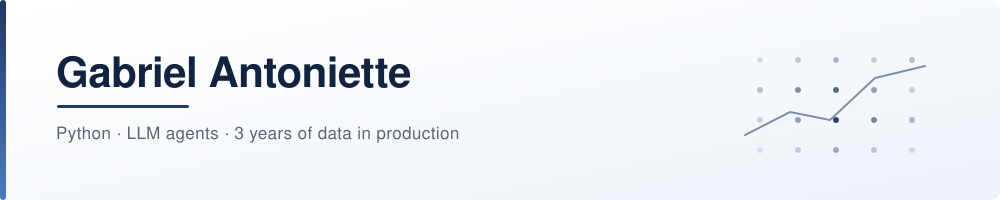
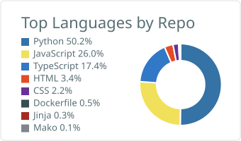
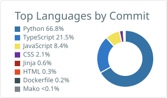

<p align="center">
  <picture>
    <source media="(prefers-color-scheme: dark)" srcset="assets/banner-dark.svg">
    <source media="(prefers-color-scheme: light)" srcset="assets/banner-light.svg">
    
  </picture>
</p>

<p align="center">
  
</p>

<p align="center">
  <a href="https://www.linkedin.com/in/gabriel-antoniette/">
    
  </a>
  <a href="mailto:gabrantoniette@gmail.com">
    
  </a>
  
  
</p>

---

### About

Short version: I spent three years making sure data was right before anyone made a decision with it. Now I'm doing the same thing one layer up, for models.

My current job is called Data Quality Analyst. What I actually do is find where a model gets things wrong: which field it misreads, which entities it misclassifies, how much of that would reach production if nobody checked. Around 20,000 transaction batches a week.

I don't have professional experience as an AI engineer yet. What I do have is three years of production data work, plus the systems I'm building on my own time to close the gap: RAG, multi-agent orchestration, API development.

Everything I build ends up here, working.

```python
from dataclasses import dataclass


@dataclass(frozen=True)
class Gabriel:
    now: str = "Data Quality Analyst, model evaluation in practice"
    heading: str = "AI Engineering"
    stack: tuple[str, ...] = ("Python", "FastAPI", "PostgreSQL", "Docker", "LLM agents")
    background: tuple[str, ...] = ("3 years as Data Analyst and Engineer", "Data Transformation", "Reports", "BI")
    education: tuple[str, ...] = (
        "Technologist Degree (2-year undergraduate): Data Science, FIAP",
        "Postgraduate, in progress: Software Engineering with Applied AI, UNIPDS",
    )
    languages: tuple[str, ...] = ("Portuguese (native)", "English (full professional proficiency)")

    def currently_building(self) -> str:
        return "Multi-agent systems in Python to help me generate content and engage with my social media audience."

    def open_to(self) -> list[str]:
        return ["AI engineering roles"]
```

---

### Stack

<!-- stack:start -->
**AI and Python**

<p>
  
  
  
  
  
  
</p>

**Backend and data**

<p>
  
  
  
  
  
  
  
</p>

**Infrastructure**

<p>
  
  
  
</p>

**Frontend, when the project needs one**

<p>
  
  
  
  
  
</p>

**From the data years**

<p>
  
  
  
  
</p>
<!-- stack:end -->

---

### What I'm building

<!-- projects:start -->
#### [Products Recommendations](https://github.com/gabrantoniette/products-recommendations): a recommender that will train in the browser

<p>
  <a href="https://github.com/gabrantoniette/products-recommendations">
    
  </a>
  
</p>

<p>
  <picture>
    <source media="(prefers-color-scheme: dark)" srcset="assets/generated/languages/products-recommendations-dark.svg">
    
  </picture>
</p>

An e-commerce page that runs entirely in the browser: pick a customer, see what they bought, buy something else. Those purchases are the data a TensorFlow.js network will learn to recommend products from, in a Web Worker so the page never freezes, with tfjs-vis wired up to chart the training.

It's early. The page, the purchase tracking and the worker plumbing run; the network doesn't exist yet, and the training step is a placeholder that reports progress without learning anything. The README says so in its opening lines.

<p>
  <code>JavaScript</code> <code>TensorFlow.js</code> <code>tfjs-vis</code> <code>Web Workers</code> <code>Bootstrap</code>
</p>

<br>

#### [Students Categorization](https://github.com/gabrantoniette/students-categorization): from a dirty CSV to a neural network

<p>
  <a href="https://github.com/gabrantoniette/students-categorization">
    
  </a>
  
</p>

<p>
  <picture>
    <source media="(prefers-color-scheme: dark)" srcset="assets/generated/languages/students-categorization-dark.svg">
    
  </picture>
</p>

A study project that walks the whole path of a classification problem. A Python medallion pipeline takes 10,000 rows of messy, fictional student data, validates them against a JSON data contract and encodes the 6,574 valid students as vectors for a TensorFlow.js network running in Node.

The whole path is done: bronze keeps the CSV as it arrived, silver applies the contract and records why each of the 3,248 rejected rows failed, gold writes the input and output vectors, and a TensorFlow.js network trains on them. Students who sign up later take the same path in files of their own, and the network suggests a category for each of them. What it still doesn't do is test the model on students it has never seen, and the README says so.

<details>
<summary><b>Decisions worth the click</b></summary>

<br>

- **A contract decides what valid means.** Types, ranges, allowed values and synonyms live in one JSON file, so `sp`, `São Paulo, SP` and `sao paulo - sp` all land on `São Paulo` without an `if` in the cleaning code.
- **Rejected rows keep their reason.** Silver never drops a bad row silently: it keeps the raw values, the source line and one error column per field, so every rejection traces back to a line of the CSV.
- **Age is scaled by the contract, not by the data.** Min-max uses the contract's 18 to 65 bounds instead of the dataset's own minimum and maximum, so a new student at prediction time lands on the same scale as the training set.
- **The sign-up time is the watermark.** A run reads the whole file of new students but adds only the ones who signed up after the last student already in, so running it twice adds nothing. Every line that stays out goes to a quarantine file once, with its reason: invalid, empty, duplicate or late.
- **The roadmap is public and honest.** Contract, the three layers, training, new students and their categories are checked off; evaluating the model on unseen students is not, and the README lists it as a known issue. A study project that claims to be finished teaches nobody anything.

</details>

<p>
  <code>Python</code> <code>pandas</code> <code>TensorFlow.js</code> <code>Node.js</code> <code>JavaScript</code>
</p>

<br>

#### [Halcyon Goods](https://github.com/gabrantoniette/halcyon-goods-product-control): inventory control, three ways in

<p>
  <a href="https://github.com/gabrantoniette/halcyon-goods-product-control">
    
  </a>
  
</p>

<p>
  <picture>
    <source media="(prefers-color-scheme: dark)" srcset="assets/generated/languages/halcyon-goods-product-control-dark.svg">
    
  </picture>
</p>

A back-office inventory system in a monorepo: a FastAPI records API, a Next.js dashboard and a terminal client, all speaking one HTTP contract. No business rule lives in two places.

I split it into three applications on purpose, and not because of scale. There is no scale here. I wanted the boundary between browser and API enforced by the build.

<details>
<summary><b>Decisions worth the click</b></summary>

<br>

- **One HTTP contract, two clients.** The terminal gets the same truth as the browser, because neither one owns a rule.
- **The browser never talks to the API directly.** Requests go browser → Next.js server → FastAPI → Postgres, in that order, so the dashboard needs no CORS and the API key never reaches the browser.
- **Alembic migrations applied and rolled back in CI**, against a real PostgreSQL, not a mock.
- **108 automated tests**, with the API suite running on Python 3.11, 3.12 and 3.13.
- **`docker compose up` brings the whole stack online** with one command.

</details>

<p>
  <code>Python</code> <code>FastAPI</code> <code>SQLModel</code> <code>PostgreSQL</code> <code>Alembic</code> <code>Next.js</code> <code>TypeScript</code> <code>Docker</code>
</p>
<!-- projects:end -->

---

### GitHub at a glance

<!-- cards:start -->
<p align="center">
  <picture>
    <source media="(prefers-color-scheme: dark)" srcset="https://github-profile-summary-cards.vercel.app/api/cards/stats?username=gabrantoniette&theme=github_dark">
    <source media="(prefers-color-scheme: light)" srcset="https://github-profile-summary-cards.vercel.app/api/cards/stats?username=gabrantoniette&theme=default">
    
  </picture>
  <picture>
    <source media="(prefers-color-scheme: dark)" srcset="assets/generated/languages-by-repo-dark.svg">
    <source media="(prefers-color-scheme: light)" srcset="assets/generated/languages-by-repo-light.svg">
    
  </picture>
</p>
<!-- cards:end -->

<p align="center">
  <picture>
    <source media="(prefers-color-scheme: dark)" srcset="https://streak-stats.demolab.com/?user=gabrantoniette&hide_border=true&background=0D111700&border=30363D&stroke=30363D&ring=4A7DBF&fire=4A7DBF&currStreakLabel=4A7DBF&sideLabels=8B949E&dates=6E7681&currStreakNum=E6EDF3&sideNums=E6EDF3">
    <source media="(prefers-color-scheme: light)" srcset="https://streak-stats.demolab.com/?user=gabrantoniette&hide_border=true&background=FFFFFF00&border=D0D7DE&stroke=D0D7DE&ring=1F3864&fire=1F3864&currStreakLabel=1F3864&sideLabels=5A6674&dates=8B949E&currStreakNum=12233F&sideNums=12233F">
    
  </picture>
</p>

<p align="center">
  <picture>
    <source media="(prefers-color-scheme: dark)" srcset="https://github-profile-summary-cards.vercel.app/api/cards/profile-details?username=gabrantoniette&theme=github_dark">
    <source media="(prefers-color-scheme: light)" srcset="https://github-profile-summary-cards.vercel.app/api/cards/profile-details?username=gabrantoniette&theme=default">
    
  </picture>
</p>

<p align="center">
  <picture>
    <source media="(prefers-color-scheme: dark)" srcset="assets/generated/languages-by-commit-dark.svg">
    <source media="(prefers-color-scheme: light)" srcset="assets/generated/languages-by-commit-light.svg">
    
  </picture>
  <picture>
    <source media="(prefers-color-scheme: dark)" srcset="https://github-profile-summary-cards.vercel.app/api/cards/productive-time?username=gabrantoniette&theme=github_dark">
    <source media="(prefers-color-scheme: light)" srcset="https://github-profile-summary-cards.vercel.app/api/cards/productive-time?username=gabrantoniette&theme=default">
    
  </picture>
</p>

<p align="center">
  <sub>Some of my work lives in private repositories, so these charts tell part of the story, not all of it.</sub>
</p>

---

### Let's talk

If you hire for applied AI, or you build in this space and want to argue about something on this page, the inbox is open.

<p>
  <a href="https://www.linkedin.com/in/gabriel-antoniette/">
    
  </a>
  <a href="mailto:gabrantoniette@gmail.com">
    
  </a>
</p>

<sub>The language charts and the project language bars are drawn by this repository from my public repositories. The other stats cards are served by third-party open source projects. To host your own, see <a href="docs/self-host-stats.md">docs/self-host-stats.md</a>.</sub>
